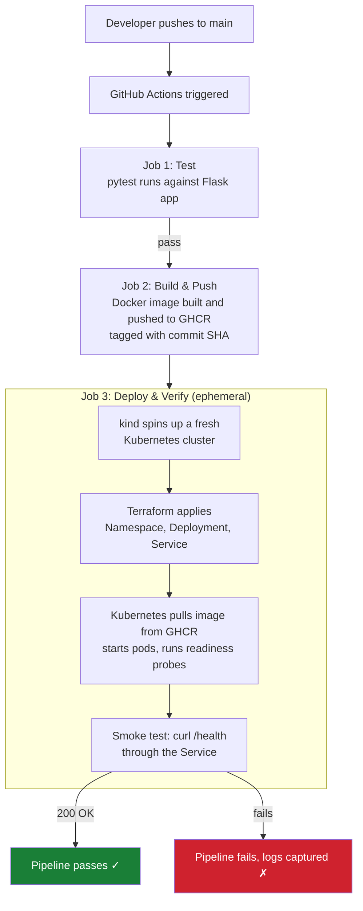

# DevOps Portfolio: Automated CI/CD Pipeline for Kubernetes

A Flask API that is automatically tested, containerized, and deployed to a
live Kubernetes cluster on every push — with infrastructure defined as
code and the entire deployment verified by an automated smoke test before
the pipeline is considered successful.

Built to demonstrate a complete, working DevOps toolchain: **Docker,
Terraform, Kubernetes, and CI/CD with GitHub Actions.**

---

## Architecture



**Local development** mirrors this exactly: the same Docker image and the
same Terraform code deploy to a persistent local `kind` cluster on your
machine, so what you test locally is what CI verifies and what would run
in production.

---

## What this project demonstrates

| Area | How it's demonstrated |
|---|---|
| **Containerization** | Multi-stage-conscious Dockerfile: slim base image, non-root user, layer caching via dependency-first `COPY`, built-in `HEALTHCHECK` |
| **Infrastructure as Code** | Kubernetes Namespace, Deployment, and Service defined in Terraform (`hashicorp/kubernetes` provider) rather than raw YAML — versioned, reviewable, reusable across environments |
| **CI/CD** | GitHub Actions pipeline with three gated stages: test → build/push → deploy/verify. A failure at any stage stops the pipeline before anything broken is deployed |
| **Kubernetes** | Real deployment with resource requests/limits, liveness and readiness probes wired to the app's `/health` endpoint, and a Service exposing the pods |
| **Automated verification** | The pipeline doesn't just deploy — it proves the deployment works by running an HTTP smoke test against a live cluster before marking the run successful |
| **Ephemeral environments** | Every CI run creates and destroys its own disposable Kubernetes cluster (`kind`), so tests always run against a clean environment with no drift |

---

## Tech stack

- **App:** Python (Flask), gunicorn
- **CI/CD:** GitHub Actions
- **Containers:** Docker
- **Registry:** GitHub Container Registry (GHCR)
- **Orchestration:** Kubernetes (via `kind` — Kubernetes-in-Docker)
- **IaC:** Terraform (`hashicorp/kubernetes` provider)
- **Testing:** pytest

---

## Repository structure

```
devops-portfolio/
├── app/
│   ├── main.py              # Flask API (/, /health, /api/tasks)
│   ├── test_main.py         # pytest suite
│   ├── requirements.txt     # runtime dependencies
│   ├── requirements-dev.txt # + pytest, for local/CI testing
│   ├── Dockerfile
│   └── .dockerignore
├── terraform/
│   ├── provider.tf           # Kubernetes provider config
│   ├── variables.tf          # image, replicas, namespace, etc.
│   ├── namespace.tf
│   ├── deployment.tf         # Deployment with probes + resource limits
│   ├── service.tf            # NodePort Service
│   └── outputs.tf
├── .github/workflows/
│   └── ci-cd.yml              # test → build/push → deploy → smoke test
└── README.md
```

---

## Running it yourself

**Prerequisites:** Docker Desktop, `kubectl`, `kind`, `terraform`, Python 3.12+

```bash
# 1. Run tests
cd app
python -m venv venv && source venv/bin/activate   # Windows: venv\Scripts\Activate.ps1
pip install -r requirements-dev.txt
pytest -v

# 2. Build and run the container
docker build -t devops-demo-api:local .
docker run -p 5000:5000 devops-demo-api:local
curl http://localhost:5000/health

# 3. Deploy to a local Kubernetes cluster
kind create cluster --name devops-portfolio
kind load docker-image devops-demo-api:local --name devops-portfolio

cd ../terraform
terraform init
terraform apply -var="kube_context=kind-devops-portfolio"

kubectl get pods -n devops-demo
kubectl port-forward -n devops-demo service/devops-demo-api 8080:80
curl http://localhost:8080/health
```

Every push to `main` runs the same flow automatically — see
[`.github/workflows/ci-cd.yml`](.github/workflows/ci-cd.yml) — against a
disposable cluster created fresh inside the CI runner.

---

## Design decisions worth noting

- **Terraform over raw `kubectl apply -f`** — manifests are parameterized
  (image tag, replica count, namespace) and can be applied consistently
  against any cluster context, local or CI, without editing YAML by hand.
- **Commit-SHA image tags, not `latest`** — every deployment is traceable
  to an exact commit; `latest` makes rollbacks and debugging ambiguous.
- **A fresh cluster per CI run** — catches "works on my machine" drift by
  never reusing state between runs.
- **The pipeline verifies, not just deploys** — a deployment that starts
  without crashing isn't proof it works; the smoke test against `/health`
  is what actually gates a pass/fail.

---

## Possible extensions

- Prometheus + Grafana for live metrics dashboards
- ArgoCD for GitOps-style continuous deployment
- Postgres with a Kubernetes-managed persistent volume, for a stateful workload
- Helm chart instead of raw Terraform-managed manifests
- Deployment to a real cloud-managed Kubernetes cluster (EKS/GKE/AKS)
